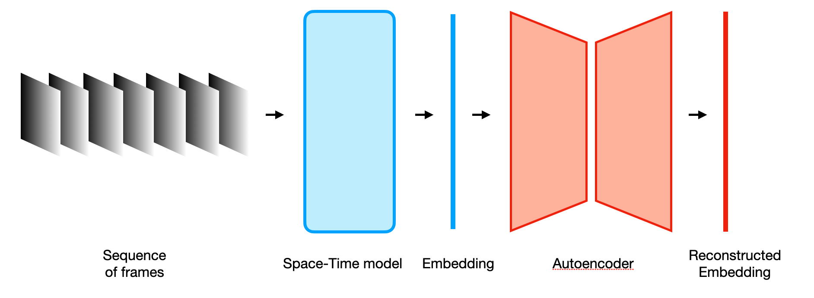
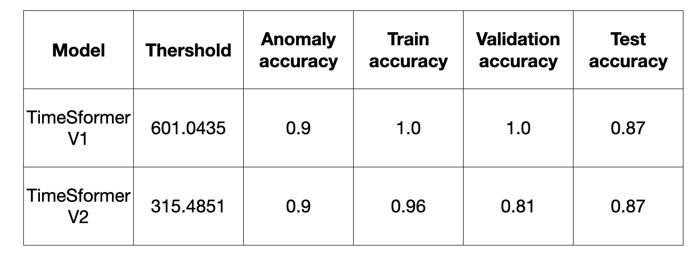

# Video anomaly detection with pretrained space-time models

In this project I show how to solve a video anomaly detection task using a pretrained space-time model 
with on top a traditional autoencoder.

You can read more about the project following the Medium post at:

In order to define a set of non anomalus clip video and another set of anomalous clips,
I will consider the UCF Sports Action Dataset. It contains
10 classes: Diving, Golf Swing, Kicking, Lifting, Riding Horse, Running, SkateBoarding, Swing-Bench, Swing-Side, Walking.
I will consider Walk-Front, Lifting and SkateBoarding-Front as anomalous action, leaving the
other as normal actions.

You can download the dataset and read its properties from this [link](https://www.crcv.ucf.edu/data/UCF_Sports_Action.php). 
The videos are in .avi format, thus we have to transform in the .mp4 format

## Preprocess

When you download and unzip the UCF Sports Action Dataset, you will note that the Golf Swing class is divided 
into the three Golf-Swing-Back, Golf-Swing-Front and Golf-Swing-Side classes and 
the class Kicking is divided into the two Kicking-Front and Kicking-Side classes. Thus we have to group the
subclasses in a single one.

Furthermore the dataset has the following structure

    videos:
        class_1:
            001:
                video_1
            002:
                video_2
            003:
                video_3
            ...
        class_2:
            001:
                video_1
            002:
                video_2
            003:
                video_3
            ...
        class_3:
            001:
                video_1
            002:
                video_2
            003:
                video_3
            ...
        ...

The final dataset, however, must have the following structure 

    videos:
        class_1:
            video_1
            video_2
            video_3
            ...
        class_2:
            video_1
            video_2
            video_3
            ...
        class_3:
            video_1
            video_2
            video_3
            ...
        ...

The Video preprocessing consists of the following steps:

1) clean and create the directories where are generated the final datasets
2) transform the videos from the .avi to the .mp4 format and generate the correct structure for the dataset
3) remove corrupted videos shorter than 1 second and split the dataset into train, validation, test and anomaly subsets
4) perform video data augmentation by Albumentations. 
   You can set the final number of videos for each category and if you want to apply data augmentation 
   only to the train set or to all the splitted subset
5) create the .csv files for train, validation, test and anomaly dataset with the path to the videos and the correct label.
    These files will be used to create the dataloaders.

The preprocess is runned by the script

```bash
python preprocess/preprocess_dataset_ucf_action_sport.py
```

With the script 
```bash
python preprocess/statistics_for_ucf_action_sport.py
```
you can extract the distribution of samples in the training, test, validation and anomaly dataset.

## Architecture

The anomaly detection model consists of two main parts. 
The first component is the pretrained space-time model. 
It takes the sequence of frames as input and returns the corresponding embedding vector. 
Next, the autoencoder takes the embedding vector as input and aims to reconstruct it at its output.



## Configurations

Before the training, you have to set the configuration properties of the network as 
 - the space-time model to use between timesformer - r2plus1d_18 - r3d - 3d_slowfast
 - the number of layers and nodes of the autoencoder
 - the number of training epochs
 - the learning rate scheduler

## Train and evaluation

The script 
```bash
python run_train_test.py --path_config_file <path_to_config>
```

starts the training and validation procedure. Every time the reconstruction error 
decreases in the validation set it is saved a new checkpoint model. At the end of the training, 
the validation phase acts on all the datasets of training, validation, test and anomaly. 
In this step I extract all possible information useful to formulate an anomaly detection criterion. Thus

 - I calculate the error reconstruction of the embedding vectors. I insert these values in a Pandas
   dataframe in order to extract a final boxplot grouped by dataset to check the distribution
 - I calculate the train latent centroids for each class
 - For each class, I calculate the distances of the latent arrays from the corresponding centroids
 - I Calculate the train embedding centroids for each class
 - For each class, I calculate the distances of the embeddings from the corresponding centroids
 - Look the TSNE distribution of the train embedding arrays and of the train latent arrays
 - For the anomaly dataset calculate the distance of the embedding from each class centroid of the train set

Running the script
```bash
python test_anomaly_clips.py --path_config_file <path_to_config> --thershold_error error --thershold_dist dist --name_output_file name_results_file
```
you can test different values of thershold errors and thershold distances to check how the clip video
in the train, validation, test and anomaly dataset are classified. Using the reconstruction error criterion
I find the following best models



You can download TimeSformer_V1 model from this [link](https://drive.google.com/file/d/1xKje9kqJBjeHyH-Wpt-pId8ZUioETYUW/view?usp=sharing)

## Environment

I use Python 3.7.9

To run the scripts in your device create an environment using the file 'requirements.txt'